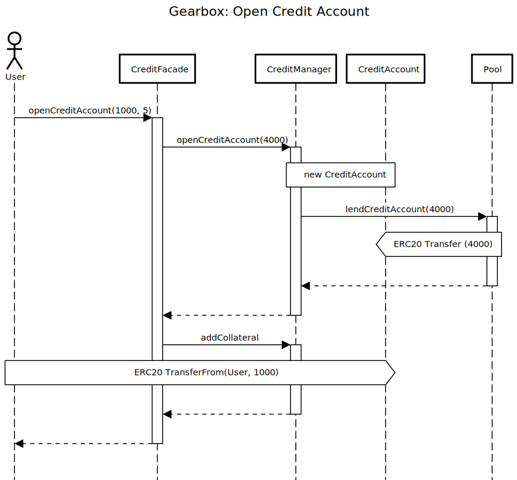
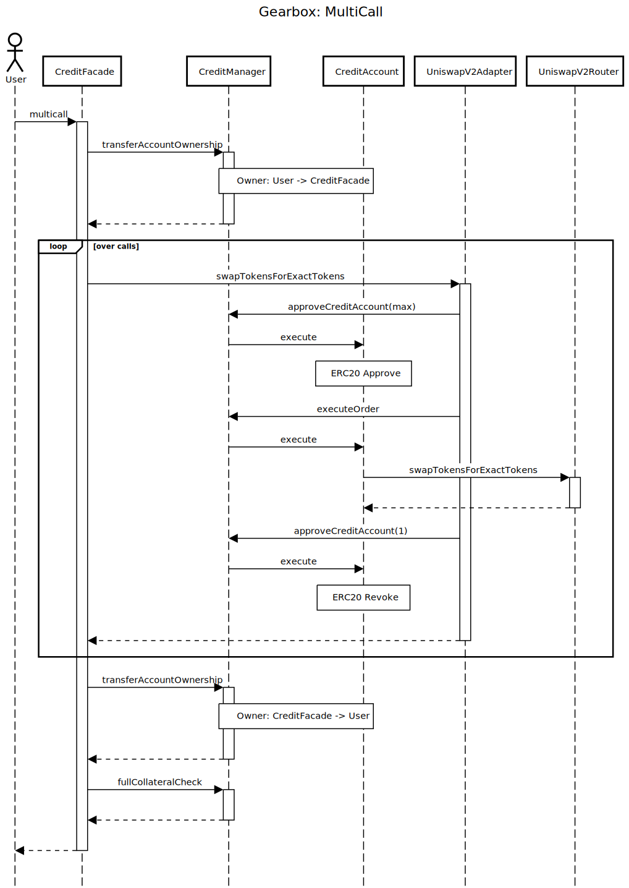
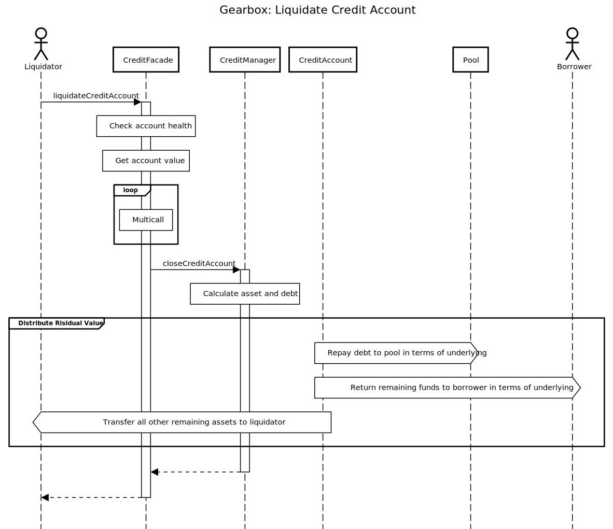

# Simple Gearbox

💡 This is the final project of Appworks Blockchain Batch.

## Description

This final project aims to implement a simple version of Gearbox, which is a defi project that enables users to leverage spot assets on whitelisted protocol, such as Uniswap.

## How to demo?

Create an `.env` file with `MAINNET_RPC_URL`.

Then run:

```solidity
forge install
forge test -vvv
```

## Introduction

There are five main components in Gearbox:

1. `CreditAccount`: This is the contract wallet that interacts with all the whitelisted protocols. The implementation is simple. It only stores debt information, and leaves an external execute function to do low level calls.
2. `CreditManager`: It contains the main logic of Gearbox, which includes the permission to execute order for a credit account, the collateral calculation, the adapters info etc.
3. `CreditFacade`: The user only interacts with CreditFacade. It will then call CreditManager and Adapter.
4. `Adapter`: Every interaction with whitelisted protocols must go through an adapter.
5. `PoolService`: Implement lending and interest logic.

### What is done

Among these components, I rewrote `CreditManager` and `CreditFacade`, and left others almost unchanged. Also, I simply copied all the interfaces to reduce complexity. Here are the features that I have implemented so far:

- Open credit accounts
- Multicall
- Collateral check
- Close credit accounts
- Liquidate credit accounts

Here are the sequence graphs of opening a credit account, multicall, and liquidate an unhealthy credit account.

- Open a credite account
  

- Multicall
  

- Liquidate a credit account
  

### Test cases

There are two tests cases in `test/SimpleGearbox.t.sol`:

- `testOpenCreditAccountAndLiquidate`
  - User1 opens a credit account with 1000 USDC and 6x leverage, which means he borrows 5000 USDC.
  - User1 swaps 5000 USDC for WETH.
  - User1 somehow earns 4100USDC, so he has 5100 USDC.
  - User1 closes his credit account.
  - User1 has 100 USDC and the WETH he swapped with the borrowed USDC.
- `testOpenCreditAccountAndLiquidate`
  - User1 opens a credit account with 1000 USDC and 6x leverage, which means he borrows 5000 USDC.
  - User1 swaps 5000 USDC for WETH.
  - The price of WETH drops so the health factor of user1’s credit account is smaller than 1.
  - User2 liquidates user1’s credit account.
    - User2 swaps some of user1’s weth to 4000 USDC.
    - User2 also repays the remained value to user1 in terms of USDC.
    - Users2 get all assets left in the credit account of user1.

### What is simplified and neglected

I have left some `Simplified` tags in the code to mark where I remove some features in the original implementation. And of course there are much more Gearbox features that don’t even exist in this project. Here are some examples that I chose to simplify or just ignore:

1. Account factory: Gearbox has a very unique way to generate and recycle CreditAccounts. However, I just simple new a contract whenever a user open an account.
2. Liquidation: Gearbox has different types of liquidation so that it can handle bad debt. I just assume that there won’t be any bad debt.
3. Access control and address provider: Gearbox has a robust structure for deploying contracts and configuring parameters. I don’t
4. Price oracle: Gearbox uses Chainlink. I use a simple oracle for testing simplicity.
5. Interest rate: To focus on the operation of credit account, I set interest rate to zero.

## Future Work

Although this project is a simplified version of Gearbox, it contains the main feature that enables user to leverage spot assets and do flexible operations with multicall. The current test cases did not cover many scenarios. I should provide more test cases with various multicalls.

Gearbox is definitely a great defi project to study! I enjoy it very much :)
